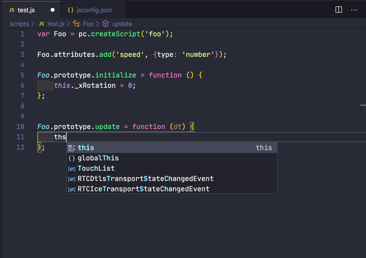

# Overview

The `pcsync` and `pcwatch` utilities allow editing copies of
JavaScript and other textual files of a PlayCanvas project
locally, on your own computer, in a text editor of your choice.

In addition, if your project has a file called [`pcignore.txt`](#the-pcignoretxt-file),
PlayCanvas merge will not affect the files listed in it,
and the operation of `pcsync` and `pcwatch` will be restricted only to those files.

`pcsync` is used to push or pull one or all files to or from PlayCanvas
(overwriting existing files with the same name/path) 
and to compare one or all local files to their 
remote (PlayCanvas) versions.
 
`pcwatch` detects changes to local files and folders (edits, renames, removal and creation)
as they happen and applies them to PlayCanvas in real time.

If you do not need your local changes pushed to PlayCanvas "as you type",
you do not have to use `pcwatch`. Running `pcsync pushAll` periodically can be
sufficient.

Only the `pcsync pull` and `pcsync pullAll` commands can change 
local files. Other `pcsync` commands and `pcwatch`
change only remote files. Thus your local
directory holds the authoritative version of your textual files.

The only scenario we do not support is when developer A uses `pcwatch`,
while developer B is editing files of the *same PlayCanvas branch* in the 
browser code editor. B's work will be overwritten by A, if they edit
the same file. Either B should start using local files, or A should stop `pcwatch` and
switch to the browser code editor.

# The `pcsync` Utility

`pcsync` has the following commands:

```
  diffAll                     compare all local and remote files and folders
  diff <filePath>             show line-by-line diff of the remote and local files at
                              filePath
  pullAll                     download all remote files, overwriting their local
                              counterparts
  pushAll                     upload all local files, overwriting their remote counterparts
  pull <filePath>             download remote file, creating local folders if needed
  push <filePath>             upload local file, creating remote folders if needed
  rename <oldPath> <newPath>  rename remote file or folder, change its parent folder if
                              needed
  rm <filePath>               remove remote file or folder
  parseIgnore                 list assets matched by pcignore.txt
```

A local directory [designated](#config-variables) as `PLAYCANVAS_TARGET_DIR`
corresponds to the root of the PlayCanvas file and folder asset hierarchy.

All file and folder paths passed to `pcsync` as arguments
should be relative to this root, e.g.

```
pcsync rename dir1/file1.js file1.js
```

will move `file1.js` to the root asset directory.

# The `pcwatch` Utility

`pcwatch` does not need any options.

While `pcwatch` is running, it is recommended to periodically run 

```
pcsync diffAll
```

to verify that the local and remote versions of all your files are indeed in sync,
especially at the beginning and the end of your coding session.

For OS-specific reasons moving a file from one directory to another
may appear to `pcwatch` as a `remove + create`. In such cases it may be better to
stop `pcwatch`, move the file locally, then move the remote file with
`pcsync rename`. Now `pcwatch` can be started again.

Similarly, it is recommended to stop `pcwatch` when
renaming or moving existing folders. Remote folders can then
be updated with `pcsync` or manually. If `pcwatch` is not
stopped, remote files and folders can get out of sync (which still
can be fixed with `pcsync` or manually).

# Note on Adding New Files as Script Components

Assume file F was  created locally
and pushed to PlayCanvas with `pcsync` or `pcwatch`, and
now you are adding F as a script component to an entity in PlayCanvas Editor.

It will take a second or two for F to appear in the dropdown list, because
F is parsed by the editor for the first time when that list is populated 
(we may add some progress indication for that).

# The `pcignore.txt` File

If your project has a file called `pcignore.txt` in the root folder, any file 
listed there will be the same before and after a PlayCanvas merge.

The operation of `pcsync` and `pcwatch` is restricted to the files listed in `pcignore.txt`,
if `pcignore.txt` exists. This ensures that the set of files managed locally
exactly matches the set ignored by PlayCanvas merge, which is appropriate
for most workflows. 

In some rare cases you may need `pcsync` and `pcwatch` to
work with more files than listed in `pcignore.txt`. This can be accomplished with
the `PLAYCANVAS_INCLUDE_REG` config variable, which is a regular expression to
compare with each file's full path from the root of the target directory, including
the file name.

Before a PlayCanvas merge, make sure that the latest checkpoint of the destination
branch is taken after `pcignore.txt` was added.

If you are using git for your textual files, it is recommended that you merge 
others' work with yours via git merge rather than PlayCanvas merge.

You complete a git merge of two branches before a PlayCanvas merge of the
corresponding branches, push the result to the PlayCanvas destination branch,
and then perform a PlayCanvas merge. 

The PlayCanvas merge will ignore the files in `pcignore.txt`
and thus your merge result checkpoint will have the correctly merged
versions of both your locally- and PlayCanvas-managed assets.

# `pcignore.txt` Syntax

`pcignore.txt` consists of one or more lines, each of which is
either a path (with the same syntax as .gitignore), or one of the following:

```
ignore_all_textual_files
ignore_all_js_files
ignore_all_files_with_extension <extension1,extension2,...>
ignore_regexp <regexp string>
```

`ignore_all_textual_files` is the most common choice.

Multiple `ignore_regexp` lines can be provided. Any textual asset whose 
full path from the root of the PlayCanvas asset hierarchy
matches an `ignore_regexp` expression will be ignored.

To check your `pcignore.txt` syntax, you can run `pcsync parseIgnore`.
It will list all existing files that match your current `pcignore.txt`.

Because of some limitations in the node library used to parse lines with gitignore syntax, 
use a space and not * or ? to match a space in a file or folder name in gitignore lines
that contain a slash.

# Installation

We recommend using a recent stable version of `node`. Dependencies may
not compile if your version of `node` is too old. `nvm` offers a
convenient way to run multiple versions of `node` on your machine.

Download or clone https://github.com/playcanvas/playcanvas-sync

On a Mac, install Command Line Tools. On Catalina, also do:
```
sudo xcode-select -s /Applications/Xcode.app/Contents/Developer
```

From the `playcanvas-sync` folder run:

```
npm install
```

After this, to install globally (this is optional), run:

```
npm install -g
```

To uninstall globally, run

```
npm uninstall -g
```

(all from the `playcanvas-sync` folder).

# Config Variables

Config values can be set 
in a file called `.pcconfig` in your home directory,
in `pcconfig.json` file in your target directory (and your PlayCanvas branch),
or provided as environment variables (which would have the highest precedence).

Sample config file:

```
{
  "PLAYCANVAS_BRANCH_ID": "abc",
  "PLAYCANVAS_PROJECT_ID": 10,
  "PLAYCANVAS_TARGET_DIR": "/Users/zpaul/proj1",
  "PLAYCANVAS_API_KEY": "abc",
  "PLAYCANVAS_BAD_FILE_REG": "^\\.|~$",
  "PLAYCANVAS_BAD_FOLDER_REG": "\\."
}
```
All these key-value pairs are necessary.

You can, for instance, keep `PLAYCANVAS_API_KEY`, `PLAYCANVAS_BAD_FILE_REG`
and `PLAYCANVAS_BAD_FOLDER_REG` in `.pcconfig` in your home directory,
and `PLAYCANVAS_BRANCH_ID` and `PLAYCANVAS_PROJECT_ID` in `pcconfig.json` in your project.

`PLAYCANVAS_TARGET_DIR` can be set in `.pcconfig` or as an environment variable.

You can copy your project id from the URL of your project home page, e.g.
for `https://playcanvas.com/project/10/overview/test_proj` the id is 10.

You can copy your branch id from the list of branches in the
Version Control Panel of the PlayCanvas Editor.

# Files and Folders to Exclude

Many text editors and operating systems
create local auxiliary files and directories,
that do not need to be automatically pushed to PlayCanvas.

`PLAYCANVAS_BAD_FILE_REG` and `PLAYCANVAS_BAD_FOLDER_REG` contain RegExp strings (note the
double escapes) that tell `pcwatch` which files and directories to
ignore. In our sample `.pcconfig`, a bad file has a name that starts
with a dot or ends with `~`.
A bad folder is one that has a dot anywhere in its path relative 
to `PLAYCANVAS_TARGET_DIR`. The expressions provided are sufficient in most cases,
and you can simply copy them into your `.pcconfig`.

To determine which auxiliary files and folders your OS and text editor
create, run `pcwatch` with environment (or `.pcconfig`) variables
`PLAYCANVAS_DRY_RUN` and `PLAYCANVAS_VERBOSE` set to `1`, and create/edit some files.

`pcwatch` output will show file system events as they happen,
and which of them will be filtered out by your current 
`PLAYCANVAS_BAD_FILE_REG` and `PLAYCANVAS_BAD_FOLDER_REG`.

If in your case no bad files and folders exist, use a string like
`"matchNothing"` as the value of `PLAYCANVAS_BAD_FILE_REG` 
and/or `PLAYCANVAS_BAD_FOLDER_REG`.

# Sample Workflows

## Case 1: Single user per PlayCanvas branch, with `git`

* Create your own PlayCanvas branch of your team's project
* Create a git branch for your work, and make it your local target directory
* Create a [`pcignore.txt`](#the-pcignoretxt-file) file, listing all files 
you intend to keep in git, create a PlayCanvas checkpoint that includes your `pcignore.txt`
* Launch `pcwatch`
* Start editing/creating files locally in your own text editor
* When necessary, merge in `git` the branch of another group member into your branch 
* Use `pcsync pushAll` to update your remote branch after git merge
* Merge the same branches in PlayCanvas. Because of your `pcignore.txt`,
your remote copies of git merge result files will not be affected
* Use `pcsync diffAll` to verify that local and remote files are still in sync

## Case 2: Multiple users working on the same PlayCanvas branch, with `git`
 
Most items from Case 1 apply, also:
 
* Periodically run `pcsync diffAll`. It is usually OK to see extra remote files 
(coming from other team members). If you notice that a remote file 
is different from your local file, consider a `git` merge to include your
team member's changes into your `git` branch, resolve conflicts in `git`, if any, as usual.
* Avoid `pcsync pull/pullAll`. To get others' files/changes into your branch, 
use `git` merge instead to maintain an accurate `git` history of edits to each file 
(who added what).
 
## Case 3: Single user per PlayCanvas branch, without `git`

* Create your own PlayCanvas branch of your team's project
* Run `pcsync pullAll` to download existing textual files 
from PlayCanvas
* Launch `pcwatch`
* Start editing/creating files locally in your own text editor

To merge changes from another PlayCanvas branch into your branch without `git`:

* Stop `pcwatch`
* Run `pcsync diffAll`, and, if necessary, `pcsync push/pushAll` to
make sure the PlayCanvas version is up-to-date.
* Perform merge in PlayCanvas
* Use `pcsync pullAll` to download the merge result

# Using TypeScript

## TypeScript Bindings

You can build TypeScript Bindings from the PlayCanvas engine repo (branch `stable`)
as mentioned in the [instructions here](https://github.com/playcanvas/engine):

```
npm run tsd
```

This will generate the file `build/output/playcanvas.d.ts` in your engine folder.

## TypeScript Workflow

TypeScript source files are usually compiled into a single JavaScript file, which is
then used in a PlayCanvas project.

This JavaScript file can be added to your [`pcignore.txt`](#the-pcignoretxt-file)
to prevent PlayCanvas merge from reporting conflicts in it.

If you are storing your TypeScript source files in git, there is no need
to include them in your PlayCanvas project.
 
# Setting up Visual Studio Code for local editing on Mac

Copy the file `playcanvas.d.ts` with [TypeScript bindings for the PlayCanvas engine](#typescript-bindings) to 
a folder called `typings` in your target directory.

Create a `jsconfig.json` file in your target directory with the following content:

```
{
    "compilerOptions": {
        "target": "ES5",
        "module": "commonjs",
        "files": [
            "typings/playcanvas.d.ts"
        ]
    }
}
```

Your folder structure should look like this:


Add `jsconfig.json` and `typings` to `PLAYCANVAS_BAD_FILE_REG` and `PLAYCANVAS_BAD_FOLDER_REG`, e.g.

```
"PLAYCANVAS_BAD_FILE_REG": "^\\.|~$|jsconfig.json",
"PLAYCANVAS_BAD_FOLDER_REG": "^\\.|typings"
```

Now you are ready to start using `pcsync` and `pcwatch` 
to sync your PlayCanvas project and edit with VS Code goodness 🚀

 
 
# TODO

* JS files created with `pcwatch` or `pcsync` are parsed by the editor when
a user selects a script to be added as a component to some entity. It may
take a second or two before the newly parsed script is added to the dropdown,
some progress indication may be useful. 

* Add an Editor button to generate a .pcconfig file 
with fields like project id and branch id already filled in
