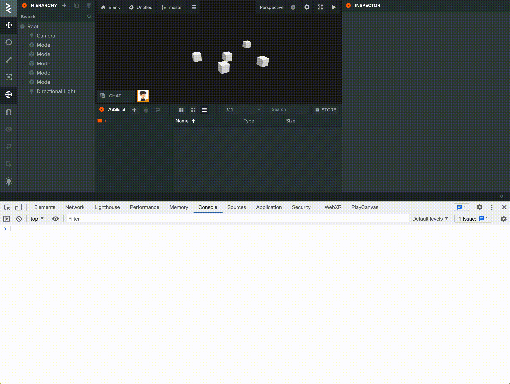

# Step-by-Step Setup Guide

This is a brief step-by-step installation and setup guide to
supplement our [README](README.md), which
provides details and alternatives for the steps below.

Install a recent stable version of `node`.
We recommend using `nvm`.

Download or clone https://github.com/playcanvas/playcanvas-sync

Install dependencies by running from the `playcanvas-sync` folder.

```
npm install
```

After this, you can either run the tool from the `playcanvas-sync` folder,
or install it globally with
```
npm install -g
```

To uninstall globally, run

```
npm uninstall -g
```
Get your PlayCanvas API key (token) from your PlayCanvas account page
(playcanvas.com/&lt;username&gt;/account). Instructions can be found in our
[User Manual page here](https://developer.playcanvas.com/en/user-manual/api/#authorization).

From the Chrome Developer Tools console
(on the PlayCanvas Editor page) run
```
copy({
  PLAYCANVAS_BRANCH_ID: config.self.branch.id,
  PLAYCANVAS_PROJECT_ID: config.project.id
})
```
This will copy your branch and project id to the clipboard.



Paste them into a file called `.pcconfig` in your home directory.

* Windows Home Directory: `C:\Users\<username>`
* Mac Home Directory: `/Users/<username>`

Alternatively, you can also find these ids from the editor and
project pages via the
[steps outlined in the User Manual](https://developer.playcanvas.com/en/user-manual/api/#parameters).

Create a directory for the local versions of your PlayCanvas files, e.g.
`proj1`. Add its full path to `.pcconfig` in the home directory, along
with your API key.

A sample full `.pcconfig` should look like this:

```
{
  "PLAYCANVAS_BRANCH_ID": "abc",
  "PLAYCANVAS_PROJECT_ID": 10,
  "PLAYCANVAS_TARGET_DIR": "/Users/zpaul/proj1",
  "PLAYCANVAS_API_KEY": "xyz",
  "PLAYCANVAS_BAD_FILE_REG": "^\\.|~$",
  "PLAYCANVAS_BAD_FOLDER_REG": "\\."
}
```
The variables `PLAYCANVAS_BAD_FILE_REG` and `PLAYCANVAS_BAD_FOLDER_REG` tell
the tool which files and folders to exclude when pushing changes to the
PlayCanvas project.

Their values in our sample `.pcconfig` above are sufficient for most projects, so
you can simply copy them. More details
[here](README.md#files-and-folders-to-exclude).

`pcsync` and `pcwatch` are now ready to use. Depending on
whether you intend to use `git` to store your local
textual files, you can select and follow one of our
[sample workflows](README.md#sample-workflows).

If you plan to merge your textual
files with `git`, consider using
[`pcignore.txt`](README.md#the-pcignoretxt-file)
to exclude them from PlayCanvas merge.
